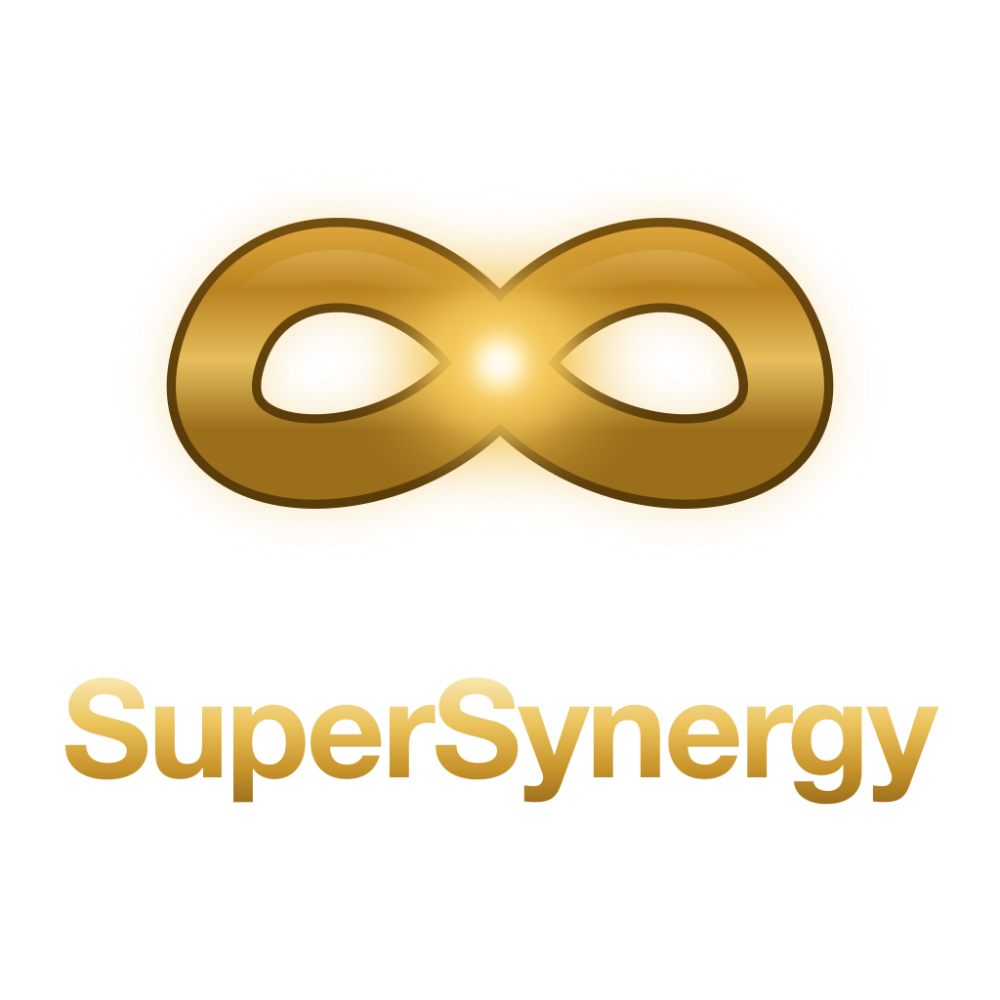

### Local-first tooling for AI coding agents

---

## About

I build local-first tooling for AI coding agents. Token routing, long-term memory, fleet orchestration and repo diagnostics, all of it running on your own machine against your own files. Rust where speed decides, Python where shipping does.

## Featured

| Project | Stack | What it does |
|---|---|---|
| **[agent-token-saver](https://github.com/Supersynergy/agent-token-saver)** | Python | Measured token routing for any CLI coding agent |
| **[synapse-memory](https://github.com/Supersynergy/synapse-memory)** | Rust | Long-term memory for coding agents in a private SQLite file, with temporal truth and cited context |
| **[agentmaster](https://github.com/Supersynergy/agentmaster)** | Rust | TUI command center for agent fleets running under Claude Code or Codex |
| **[pum](https://github.com/Supersynergy/pum)** | Rust | Package update manager with a DuckDB freshness ledger, CLI and MCP server ([tap](https://github.com/Supersynergy/homebrew-pum)) |
| **[mdviewy](https://github.com/Supersynergy/mdviewy)** | Tauri, TS | A calm, fast, local-first Markdown workspace for your own files |
| **[debugmaster](https://github.com/Supersynergy/debugmaster)** | Python | Fail-safe repo diagnostics for humans and AI coding agents |

## Stack

## More

The [repository list](https://github.com/Supersynergy?tab=repositories) holds the rest: shell tooling, local-AI experiments, and curated `awesome-*` lists. Anything marked as a fork is someone else's work that I build on.
